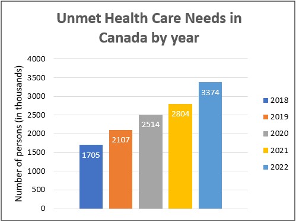
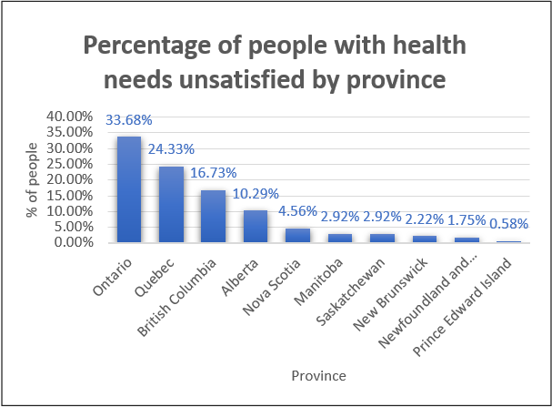
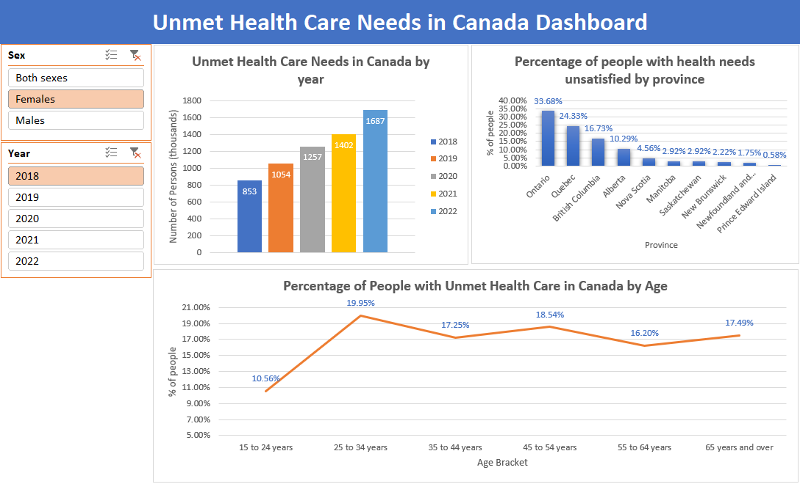

# Descriptive Analysis of Unmet Health Care Needs

## Table of Contents
  - [Objective](#objective)
  - [Dataset](#dataset)
  - [Tools](#tools)
  - [Methodology](#methodology)
  
## Objective

The primary goal of this project is to analyze data on unmet healthcare needs to understand patterns and identify critical demographics affected by access issues.  

## Dataset

The dataset from Statistics Canada: Table 13-10-0836-01  Unmet health care needs by sex and age group (DOI: https://doi.org/10.25318/1310083601-eng3) contains the following key features:

- Year: Year
- GEO: Geography location of a Province such as British Columbia, Ontario, Nova Scotia, etc.
- Sex: Female, Male, or both sexes.
- Value: Quantity of people in thousands.
- Status: Data Quality 
  - E Use with caution
  - F too unreliable to be published
  - A data quality: Excellent
  - B data quality: Very good
  - C data quality: Good
  - D data quality: Acceptable

## Tools

- Excel: for data cleaning, exploratory analysis, and visualization.

## Methodology

### 1. Data Collection and Preparation

The data cleaning includes:

Data loading and inspection
Standardizing the structure of the data.

### 2. Descriptive Analysis

The analysis includes answers to questions such as:

What was the total number of persons with unmet healthcare needs in Canada?

What was the percentage of people with health needs unsatisfied by province in 2018?

### 3. Data Visualization

Excel Dashboard

### 4. Insights and Findings

- Among the total population in Canada, the number of healthcare needs unsatisfied has increased since 2018. In 2022, the number of people with unmet healthcare needs was 2953 thousand; of that quantity, 57.1% corresponds to females and 42.9% to males.
- Of the ten provinces in Canada, Ontario had the most quantity of people with health care unsatisfied with 36.36% of the total. This is followed by Quebec, 21.39%, and British Columbia, 16.55%.
- Between the age ranges of the Canadian population, the 25 to 34 bracket had the most people with unmet healthcare needs. Again, the female population led this bracket.
